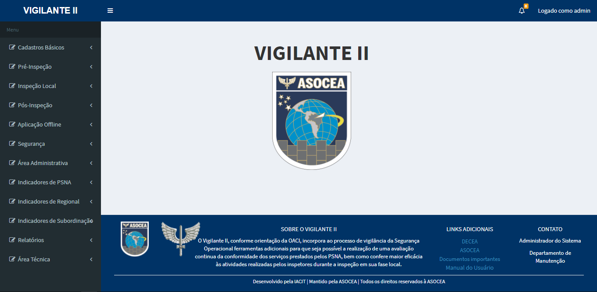

# Metodologia da Pesquisa Científico Tecnológica

Orientador: Prof.º Giuliano Araújo Bertoti  
Aluno: Gustavo Robert Moura da Conceição

## Definição do problema
    Controle, aplicação e análise das inpeções realizadas com intuito de realizar uma avaliação contínua nos serviços prestados pelos PSNA's (Provedor de Serviço de Navegação Aérea).

## Por quê este "problema" é de fato um problema?
    O cliente em questão realiza inspeções nos Provedores de Serviço da Navegação Aérea (PSNA) cadastrados com o objetivo de avaliar a conformidade dos serviços prestados. Ao decorrer do tempo se viu a necessidade de informatizar os processos, sendo assim se fez necessária a criação de um sistema que pudesse integrar toda a informação coletada antes, durante e após as inspeções e, disponibilizá-la aos profissionais responsáveis. 
    Se viu a necessidade de integrar os processos com intuito de fornecer a informação de forma precisa, concisa e responsiva.

## Proposta de solução
    Para tanto foi projetado o desenvolvimento do Sistema Vigilante, uma aplicação web onde é possível realizar o cadastro de todos os profissionais responsáveis por realizar inspeções, as organizações inspecionadas e demais envolvidos, com diferentes visões do sistema e diferentes níveis de acesso, o cadastro das inspeções e de eventuais não conformidades geradas  no ato da inspeção, acesso ao sistema de estatísticas, onde é possível visualizar os dados referentes às inspeções e às organizações cadastradas, dentre outras funcionalidades a serem descritas ao longo da dissertação.

## Sistema Vigilante II

